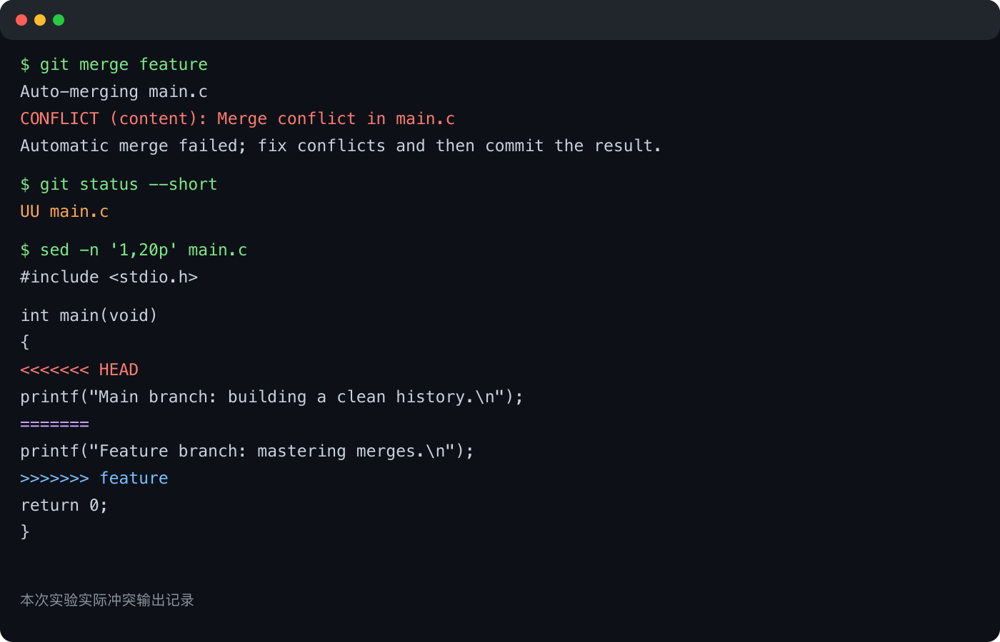

# Lab0：GitLab 实验报告

GitHub 仓库：`xu19491001nicky-wq/GitLab`

## 一、实验目的

本实验的目的是熟悉 Git 的基本工作流，理解工作区、暂存区和版本库之间的关系，掌握分支创建、切换、提交、合并以及冲突处理，并了解规范化提交信息和语义化版本的基本思想。

## 二、问题回答

### 1. 多人协同开发经历

此前接触过课程项目中的小组协作。团队通常先按功能模块分工，每位成员在自己的分支上开发，完成后通过代码审查和合并将修改集成到主分支。遇到多人同时修改同一文件时，需要先同步最新代码，再共同确认冲突部分应保留的内容。

### 2. Git 为什么设计“暂存—提交”两个步骤

暂存区让开发者能够从工作区的全部修改中挑选本次真正相关的内容，再组成一个逻辑完整的提交。这样可以把调试改动、临时文件和不同功能的修改分开，提交前也可以通过 `git diff --staged` 再次检查。提交因此不仅是保存当前目录快照，也是对修改进行筛选、组织和说明的过程。

### 3. `git branch` 和 `git branch -a` 的区别

`git branch` 默认只列出本地分支，当前分支前会显示星号。`git branch -a` 会同时列出本地分支和远程跟踪分支，因此在确认远程仓库中有哪些分支、判断某个远程分支是否已经被同步到本地时更有帮助。

## 三、延伸阅读

### 1. Commit Message 规范

[Commit Message 规范](https://www.ruanyifeng.com/blog/2016/01/commit_message_change_log.html)介绍了结构化提交信息的写法。清晰的类型、作用域和说明能帮助团队快速理解修改目的，也便于生成变更日志、检索历史和定位问题。本实验中的提交使用了 `feat`、`merge` 和 `docs` 等前缀，使每次提交的用途更加明确。

### 2. 语义化版本

[语义化版本 2.0.0](https://semver.org/lang/zh-CN/)使用“主版本号.次版本号.修订号”表达软件变化：不兼容修改提升主版本号，向后兼容的新功能提升次版本号，向后兼容的问题修复提升修订号。它让依赖方能够根据版本号判断升级风险。

### 3. 为什么要学习 Git

Git 不只是备份工具。它能够记录修改原因和演进过程，支持多人并行开发，并让每次变更都可审查、可回退、可追踪。分支把尚未稳定的开发工作与主线隔离，合并和冲突处理则提供了明确的协作机制。即使是个人项目，良好的提交历史也能降低试验新方案和定位错误的成本。

## 四、实验步骤

1. 使用课程提供的模板仓库创建个人仓库，保留模板中的自动评分 workflow。
2. 克隆个人仓库并阅读 `README.md`、`Makefile` 和 `main.c`。
3. 完成 `main.c` 中的 TODO，并提交 `feat: complete TODO in main.c`。
4. 从主分支创建 `feature` 分支，修改输出内容并提交。
5. 返回主分支，对同一行输出内容进行不同修改并提交。
6. 在主分支执行 `git merge feature`，Git 检测到 `main.c` 的内容冲突。
7. 检查冲突标记，综合两个分支的意图修改最终内容，然后暂存并创建合并提交。
8. 执行 `make`、`./main` 和 `make clean`，确认程序能正常编译、运行和清理。

## 五、冲突与解决记录

执行 `git merge feature` 时，终端显示 `CONFLICT (content): Merge conflict in main.c`，并且 `git status --short` 显示 `UU main.c`。



冲突原因是两个分支从同一提交出发，分别修改了同一条 `printf` 语句。Git 无法自动判断应保留哪一项修改，因此写入了 `<<<<<<< HEAD`、`=======` 和 `>>>>>>> feature` 冲突标记。

解决冲突后，最终代码为：

```c
#include <stdio.h>

int main(void)
{
    printf("Main and feature branches merged successfully.\n");
    return 0;
}
```

提交历史如下：

```text
*   a4d80b7 merge: resolve main.c conflict
|\
| * ac4acfb feat: update feature branch message
* | fcf6892 feat: update main branch message
|/
* 931e4db feat: complete TODO in main.c
* 907ab21 Initial commit
```

## 六、运行结果

```text
gcc -Wall -O2 -c main.c -o main.o
gcc -Wall -O2 -o main main.o
Main and feature branches merged successfully.
rm -f main.o main
```

程序编译和运行均成功，清理后没有残留生成文件。

## 七、实验总结

通过本实验，我完整实践了从修改、暂存、提交到分支合并的工作流。主动让两个分支修改同一行可以稳定复现内容冲突。解决冲突时不能只删除 Git 标记，还需要理解两个分支各自的意图，并通过编译和运行确认最终结果正确。
